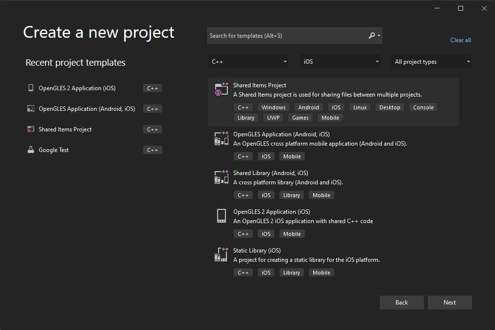
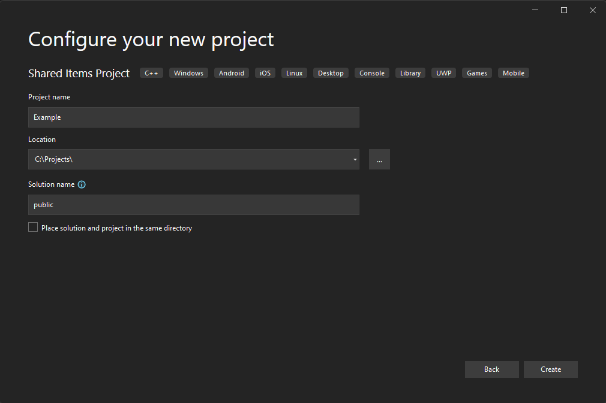
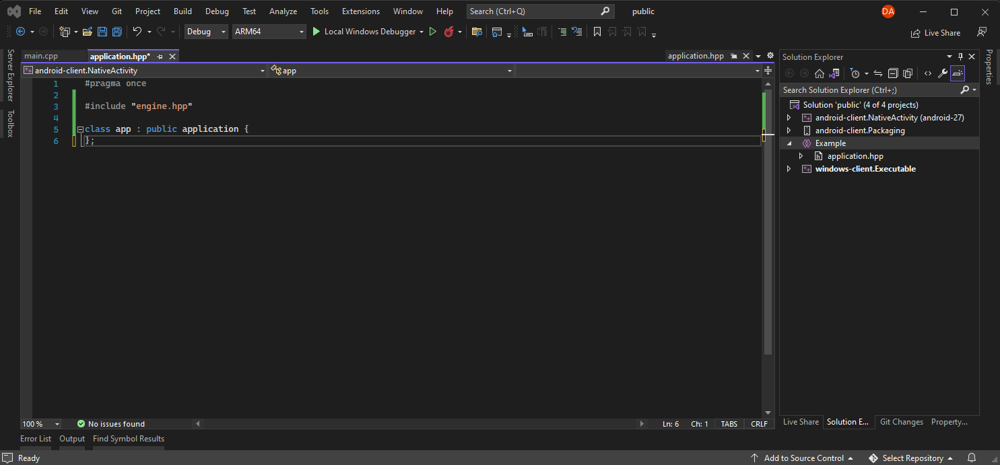
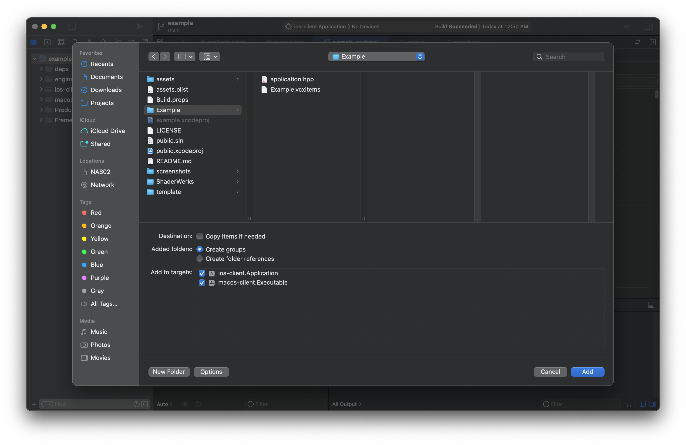
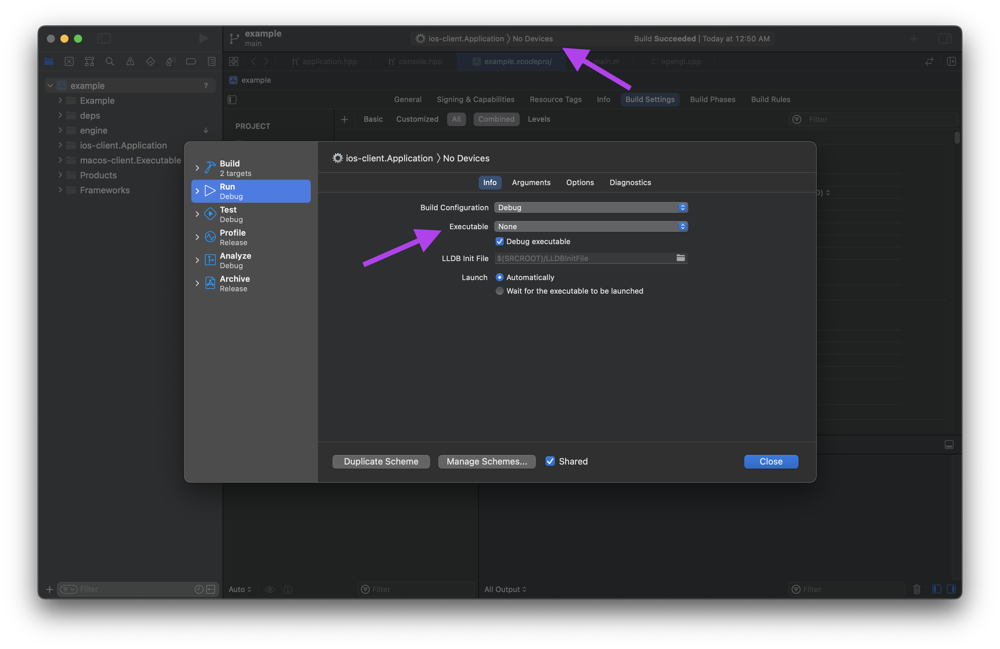

# Public

Publicly shared applications and examples.  The [Application Template](https://github.com/shizgnit/application-template/blob/develop/README.md) has details on the build requirements.

# Application Template

Using the template engine starts with just adding it as a submodule.

    git submodule add https://github.com/shizgnit/application-template.git template
    git submodule update --init --recursive

# Visual Studio (Windows, Linux, Andoid)

Create a Build.props file at the root directory of the repo that provides the application that is currently being built.  The only value that needs to be set is *Example* string which needs to also match the directory for the solution application.hpp header file.

    <?xml version="1.0" encoding="utf-8"?>
    <Project ToolsVersion="4.0" xmlns="http://schemas.microsoft.com/developer/msbuild/2003">
      <ImportGroup Label="PropertySheets" />
      <PropertyGroup Label="UserMacros">
        <TargetBuildApplication>*Example*</TargetBuildApplication>
      </PropertyGroup>
      <PropertyGroup />
      <ItemDefinitionGroup />
      <ItemGroup>
        <BuildMacro Include="TargetBuildApplication">
          <Value>$(TargetBuildApplication)</Value>
          <EnvironmentVariable>true</EnvironmentVariable>
        </BuildMacro>
      </ItemGroup>
    </Project>

Create a Shared Items Project for the application.

Specify the project name as the same value as above.

Include the projects for the various binary targets and a single application.hpp header with the following contents.

    #pragma once
    
    #include "engine.hpp"
    
    class app : public application {
    };

Set the target platform as the startup project, build and run.

# XCode (MacOS, IOS)

For xcode the quickest way to get going is to copy the public.xcodeproj and simply rename it to whatever you'd like.  Then remove the example and add your application specific code.

Then just set the target executable and you're done.

